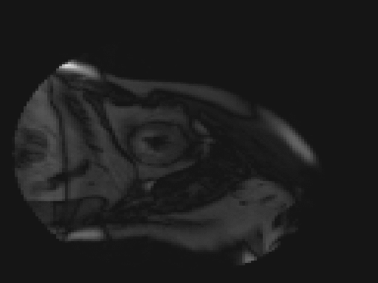
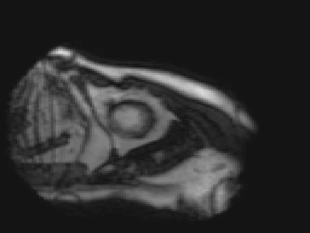

  

Unsupervised and weakly-supervised algorithms.

High-quality software. Robust validation and documentation.

Open-accessible data. Efficient training. Rapid deployment.

 

  

 

<h2 align=center>Get Started</h2>

  Not sure where to start? Check out the <a href="https://deepreg.readthedocs.io/">documentation</a> and <a href="https://deepreg.readthedocs.io/en/latest/demo/introduction.html">demos</a>.
    
  Have a look at our  to medical image registration.

